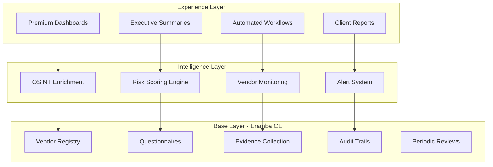

# GRC-TPRM Platform

A hybrid Governance, Risk, and Compliance Third-Party Risk Management platform built on open-source foundations with intelligent automation and premium user experience.

## Architecture Overview

### Three-Layer Hybrid Architecture



### Layer Breakdown

#### 1. Base Layer (Open Source)
**Technology:** Eramba Community Edition
- Vendor registry management
- Questionnaire creation and distribution
- Evidence collection and storage
- Complete audit trails
- Periodic review scheduling

#### 2. Intelligence Layer (Custom Development)
- **OSINT Enrichment**: Automated gathering of open-source intelligence on vendors
- **Risk Scoring Engine**: Algorithmic risk assessment based on multiple data points
- **Vendor Monitoring**: Real-time tracking of domains, data leaks, and CVEs
- **Alert System**: Proactive notifications for risk events

#### 3. Experience Layer (Premium UX)
- **Premium Dashboards**: Interactive visualizations using Grafana or React
- **Executive Summaries**: Auto-generated high-level reports for stakeholders
- **Automated Workflows**: Orchestrated processes using n8n or similar
- **Client-Facing Reports**: Polished, branded deliverables

## Technology Stack

- **Base Platform**: Eramba Community Edition (PHP-based)
- **Container Runtime**: Docker + Docker Compose
- **Backend Services**: Python/Node.js microservices
- **Frontend**: React.js for custom dashboards
- **Workflow Orchestration**: n8n
- **Monitoring Dashboards**: Grafana
- **Database**: MySQL (Eramba), PostgreSQL (custom services)
- **Environment**: WSL (Ubuntu)

## Prerequisites

- WSL2 with Ubuntu installed
- Docker Engine and Docker Compose
- Git configured with SSH
- At least 4GB RAM allocated to WSL
- 20GB available disk space

## Quick Start

### 1. Clone the Repository

```bash
git clone git@github.com:YOUR_USERNAME/GRC-TPRM.git
cd GRC-TPRM
```

### 2. Start Base Layer (Eramba)

```bash
cd eramba
docker compose up -d
```

Access Eramba at `http://localhost:80`

### 3. Start Intelligence Layer

```bash
cd ../intelligence-layer
docker compose up -d
```

### 4. Start Experience Layer

```bash
cd ../experience-layer
npm install
npm run dev
```

## Project Structure

```
GRC-TPRM/
├── README.md
├── skills.md                 # Development skills and learnings
├── test.md                   # Testing documentation
├── eramba/                   # Base layer
│   ├── docker-compose.yml
│   └── README.md
├── intelligence-layer/       # OSINT and risk scoring
│   ├── osint-service/
│   ├── risk-engine/
│   ├── vendor-monitor/
│   └── alert-service/
├── experience-layer/         # Premium UX
│   ├── dashboards/
│   ├── reports/
│   └── workflows/
└── docs/                     # Additional documentation
    ├── ARCHITECTURE.md
    ├── API.md
    └── DEPLOYMENT.md
```

## Development Workflow

1. All development is done in WSL environment
2. Code changes are committed with descriptive messages
3. Documentation is updated alongside code changes
4. Testing is performed before pushing to GitHub
5. SSH is used for all Git operations

## Documentation

- [Architecture Details](docs/ARCHITECTURE.md)
- [API Documentation](docs/API.md)
- [Deployment Guide](docs/DEPLOYMENT.md)
- [Skills and Learnings](skills.md)
- [Testing Guide](test.md)

## Contributing

This is a custom enterprise solution. For questions or issues, please contact the development team.

## License

Proprietary - All rights reserved

---

**Status**: 🚧 In Active Development
**Last Updated**: 2026-02-06
